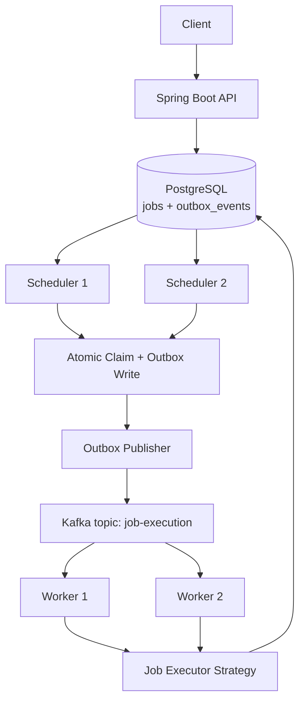
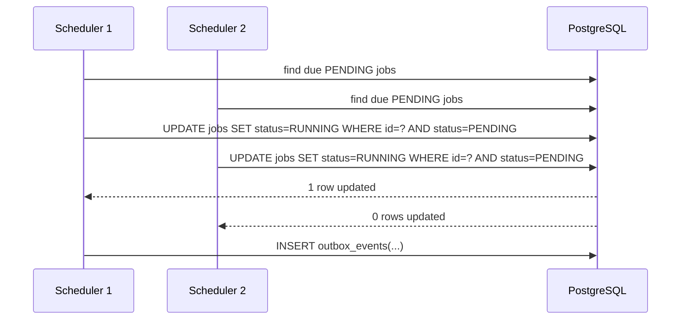

# Distributed Job Scheduler Architecture

## Overview

This project keeps PostgreSQL as the source of truth for job state and uses Kafka only for durable asynchronous delivery between schedulers and workers.

## Component Responsibilities

- `JobController` accepts job creation and job lookup requests. It never updates lifecycle state directly.
- `JobRepository` owns database-driven concurrency primitives such as atomic claims and lease acquisition.
- `JobScheduler` scans due `PENDING` jobs and delegates claiming to `SchedulerDispatchService`.
- `SchedulerDispatchService` performs the critical same-transaction write: `jobs` row update plus `outbox_events` insert.
- `OutboxPublisher` reads unpublished outbox rows with `FOR UPDATE SKIP LOCKED`, publishes to Kafka, then marks them published.
- `JobExecutionConsumer` and `JobWorkerService` consume Kafka messages, acquire worker leases, execute jobs, and persist outcomes.
- `JobStateService` enforces valid transitions and centralizes retry/backoff behavior.
- `LeaseRecoveryService` scans for stale `RUNNING` jobs and requeues them when a worker lease expires.

## Data Model

### `jobs`

- `id`: UUID primary key
- `job_type`: logical executor selection
- `job_status`: `PENDING`, `RUNNING`, `COMPLETED`, `FAILED`
- `payload`: JSON stored through Hibernate JSON mapping
- `created_at`, `updated_at`, `scheduled_at`, `completed_at`
- `retries`, `max_retries`
- `worker_id`, `locked_at`
- `last_error`

### `outbox_events`

- `id`: UUID primary key
- `aggregate_id`: job identifier
- `event_type`: currently `JOB_EXECUTION_REQUESTED`
- `payload`: serialized `JobExecutionMessage`
- `published`, `published_at`, `publish_attempts`, `last_error`
- `created_at`

## Critical Flow: Atomic Claiming

The scheduler race is resolved by the database, not by application-side checks.

## Worker Model

- Kafka consumer group: `job-workers`
- Workers scale horizontally by running additional instances in the same group.
- Each worker must acquire a lease before execution so duplicate deliveries do not become concurrent unsafe execution.
- Completed jobs are skipped on redelivery, which provides practical idempotency for this demo system.

## Deployment Shape

`docker-compose.yaml` runs:

- `postgres`
- `kafka` in KRaft mode
- `api`
- `scheduler-1`
- `scheduler-2`
- `worker-1`
- `worker-2`

The same application image is reused for every role, with behavior toggled through environment properties.
